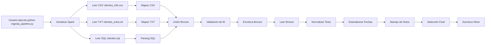
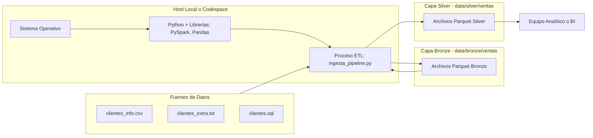

 Informe Equipo A (Bronze & Silver)  
Entrega: Pipeline de Datos de Clientes

**Proyecto:** Ingesta y Limpieza de Datos de Clientes para Adquisición en Chile  
**Fecha de Entrega:** 01 de Diciembre, 2025  
**Responsables:**  
- William Moncada  
- Matias Osores  
- Catalina Fajardo  
- Dilan Ferreira  
- Jean Piere Trinidad  

**Destinatario:** Equipo de Análisis (Equipo B – Silver)

---

## 1. Resumen del Entregable (Ingeniería de Datos)

El pipeline de ingesta y limpieza ha sido completado y ejecutado exitosamente.  
La información consolidada de los clientes ha sido procesada desde sus formatos crudos (CSV, TXT, SQL) y ahora reside en la capa **Silver**, lista para consumo analítico y modelado.

| Capa   | Ubicación               | Estado              |
| ------ | ---------------------- | ------------------- |
| BRONZE | `/data/bronze/ventas/` | Crudo, Unificado    |
| SILVER | `/data/silver/ventas/` | Limpio, Normalizado |

---

## 1.1 Workflow del Pipeline ETL

---

## 2. Arquitectura de Datos y Entorno de Trabajo

### 2.1 Arquitectura de Datos (Metodología)

Se utilizó la **Arquitectura Medallion (Bronze → Silver)** para garantizar trazabilidad y calidad.

## 3. Estructura de Datos en Capa SILVER (Consumo Analítico)

### 3.1 Proceso de Limpieza y Estandarización

---

La data de entrada del CSV, TXT y SQL fue mapeada y conformada en el siguiente esquema de salida (optimizado para modelado):

| Columna                        | Origen de Datos                                   | Tipo   | Descripción y Calidad                                                    |
| ------------------------------ | ------------------------------------------------- | ------ | ------------------------------------------------------------------------ |
| `id`                           | CSV (codigo_cliente), TXT, SQL (codigo)           | String | Clave primaria unificada. Sin nulos en esta capa.                        |
| `nombre_cliente`               | SQL (nombre + apellido)                           | String | Nombre completo, normalizado (InitCap, sin espacios duplicados).         |
| `ciudad`                       | SQL (comuna)                                      | String | Ciudad/Comuna, normalizada.                                              |
| `fecha_demografica_o_registro` | SQL (fecha_nacimiento) / TXT (Fecha de actividad) | Date   | Fechas válidas y estandarizadas (YYYY-MM-DD).                            |
| `dato_extra_1`                 | SQL (rut) / CSV (promedio_compras)                | String | Campo con potencial para regresión (numeric casting según origen).       |
| `dato_extra_2`                 | SQL (religion) / CSV (tipo_alimentacion)          | String | Campo categórico para segmentación.                                      |
| `fuente`                       | Metadata                                          | String | Indica origen del registro (ej. `SQL_DUMP`, `TXT_EXTRA`, `CSV_METRICS`). |

**Reglas de limpieza:**

* Unificación de `id` (trim, lower) y eliminación de duplicados por `id` priorizando la fuente `SQL > CSV > TXT`.
* Normalización de `nombre_cliente` (capitalización de nombres, eliminar caracteres especiales no válidos).
* Estandarización de fechas a `YYYY-MM-DD`. Registros con fechas inválidas fueron marcados y descartados cuando no hubo posibilidad de corrección.
* Casting de `promedio_compras` a `float` cuando aplica; valores no coercibles a `NaN` y evaluados por regla de negocio.

---
