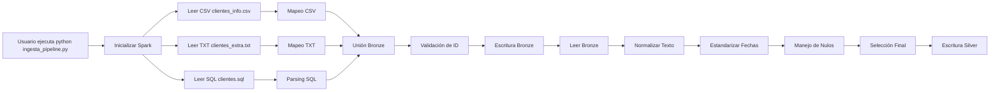
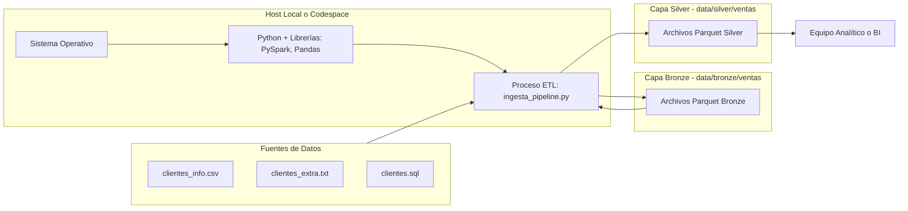
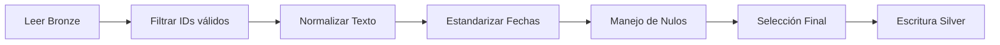
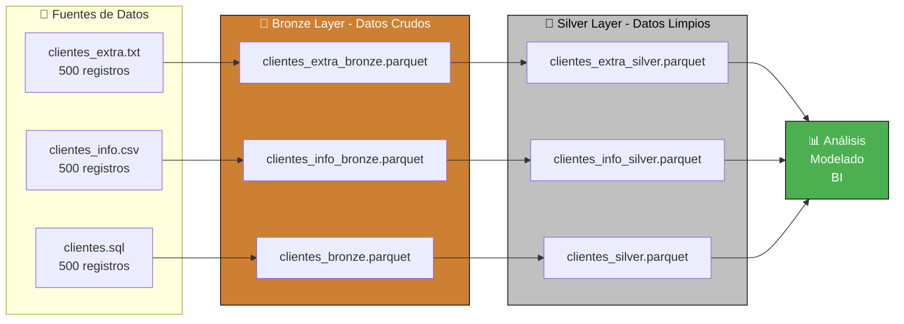
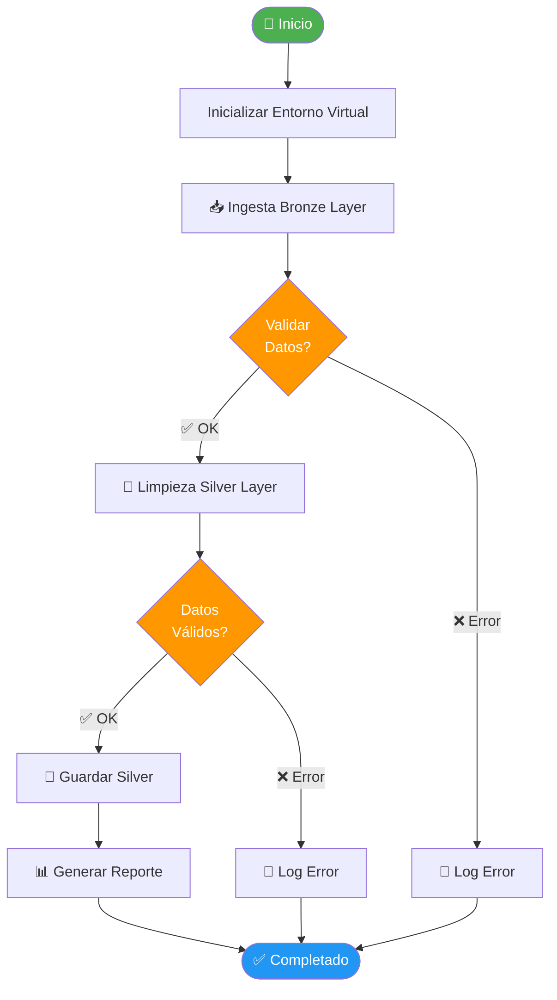

# Informe Equipo A (Bronze & Silver)   
# Entrega: Proyecto LIDL - Pipeline de Datos de Clientes

**Proyecto:** Ingesta y Limpieza de Datos de Clientes para Adquisición en Chile  
**Fecha de Entrega:** 01 de Diciembre, 2025  
**Responsables:**  
- William Moncada  
- Matias Osores  
- Catalina Fajardo  
- Dilan Ferreira  
- Jean Piere Trinidad  

**Destinatario:** Equipo de Análisis (Equipo B – Silver)


> **Ingesta y Limpieza de Datos para Adquisición de Supermercado Chileno**

[](https://www.python.org/)
[](https://spark.apache.org/)
[](https://github.com/features/codespaces)

---

##  Tabla de Contenidos

- [Resumen Ejecutivo](#-resumen-ejecutivo)
- [¿Por qué GitHub Codespaces?](#-por-qué-github-codespaces)
- [Arquitectura del Proyecto](#-arquitectura-del-proyecto)
- [Guía de Inicio Rápido](#-guía-de-inicio-rápido)
- [Estructura del Proyecto](#-estructura-del-proyecto)
- [Pipeline de Datos](#-pipeline-de-datos)
- [Verificación de Resultados](#-verificación-de-resultados)
- [Equipo](#-equipo)

---

##  Resumen Ejecutivo

Este proyecto implementa un **pipeline de datos** completo para procesar información de 500 clientes de un supermercado chileno candidato a adquisición por LIDL. Utiliza la **Arquitectura Medallion (Bronze → Silver → Gold)** para garantizar calidad y trazabilidad.
## 1.1 Workflow del Pipeline ETL



---

## 2. Arquitectura de Datos y Entorno de Trabajo

### 2.1 Arquitectura de Datos (Metodología)

Se utilizó la **Arquitectura Medallion (Bronze → Silver)** para garantizar trazabilidad y calidad.




## 3. Estructura de Datos en Capa SILVER (Consumo Analítico)

### 3.1 Proceso de Limpieza y Estandarización



---
###  Datos Procesados

| Fuente | Formato | Registros | Contenido |
|--------|---------|-----------|-----------|
| `clientes.sql` | SQL INSERT | 500 | Datos demográficos (nombre, RUT, comuna, religión) |
| `clientes_info.csv` | CSV | 500 | Métricas de comportamiento (compras, permanencia, alimentación) |
| `clientes_extra.txt` | TXT/CSV | 500 | Información de afiliación (tipo servicio, fecha) |

### ✅ Resultados

- **1,500 registros** ingestados correctamente
- **Bronze Layer**: Datos crudos en formato Parquet
- **Silver Layer**: Datos limpios y normalizados listos para análisis
- **Pipeline automatizado** con validaciones y logging

---

##  ¿Por qué GitHub Codespaces?

### Razones Técnicas

✅ **Sin problemas de sistema operativo**: Funciona igual en Windows, Mac y Linux  
✅ **Entorno pre-configurado**: Python, Java y Spark ya instalados  
✅ **Sin instalación local**: No requiere configurar tu máquina  
✅ **Colaboración instantánea**: Todo el equipo trabaja en el mismo entorno  
✅ **Recursos garantizados**: 4 cores, 8GB RAM, 32GB storage  
✅ **Gratis para uso educativo**: 60 horas/mes sin costo

### Alternativa Local

Si prefieres trabajar localmente, necesitas:
- Python 3.8+
- Java 11+ (requerido por PySpark)
- 4GB RAM mínimo
- Git

---

## Arquitectura del Proyecto

### Arquitectura Medallion



### Workflow del Pipeline



---

##  Guía de Inicio Rápido

### Opción 1: GitHub Codespaces (Recomendado) ⭐

#### Paso 1: Abrir en Codespaces

1. Ve al repositorio: `[https://github.com/TrinidadJean/lidl_project]`
2. Click en el botón verde **"<> Code"**
3. Selecciona la pestaña **"Codespaces"**
4. Click en **"Create codespace on main"**
5. Espera 2-3 minutos mientras se configura el entorno


#### Paso 2: Configurar Entorno Virtual

```bash
# El terminal se abrirá automáticamente
# Ejecuta estos comandos en orden:

# 1. Crear entorno virtual
python -m venv venv

# 2. Activar entorno virtual
source venv/bin/activate

# 3. Actualizar pip
pip install --upgrade pip

# 4. Instalar dependencias
pip install -r requirements.txt

# Verificar instalación
pip list
```

#### Paso 3: Ejecutar Pipeline

```bash
# Ejecutar pipeline completo (Bronze + Silver)
python main.py
```

**Salida esperada:**
```
============================================================
🏪 PROYECTO LIDL - PIPELINE DE DATOS
============================================================

📥 ETAPA 1: Ingesta Bronze Layer
------------------------------------------------------------
✓ clientes_extra.txt ingresado: 500 registros
✓ clientes_info.csv ingresado: 500 registros
✓ clientes.sql ingresado: 500 registros

🧹 ETAPA 2: Limpieza Silver Layer
------------------------------------------------------------
✓ clientes_extra limpiado: 500 registros
✓ clientes_info limpiado: 500 registros
✓ clientes limpiado: 500 registros

============================================================
✅ WORKFLOW COMPLETADO EXITOSAMENTE
============================================================
⏱️  Duración total: 45.23 segundos
📁 Archivos Bronze: bronze/ventas/
📁 Archivos Silver: silver/ventas/
📋 Logs: logs/
============================================================
```

#### Paso 4: Verificar Resultados

```bash
# Ver estructura de archivos generados
tree bronze/ silver/

# Ver logs del proceso
cat logs/main_workflow.log

# Ver estadísticas de ingesta
cat bronze/ventas/ingesta_stats.json
```

---

### Opción 2: Instalación Local

#### Requisitos Previos

- Python 3.8 o superior
- Java 11 o superior (para PySpark)
- Git
- 4GB RAM mínimo

#### Pasos

```bash
# 1. Clonar repositorio
git clone https://github.com/pconstancioteacher/lidl_project.git
cd lidl_project

# 2. Crear entorno virtual
python -m venv venv

# 3. Activar entorno virtual
# En Linux/Mac:
source venv/bin/activate
# En Windows (PowerShell):
venv\Scripts\Activate.ps1

# 4. Instalar dependencias
pip install -r requirements.txt

# 5. Ejecutar pipeline
python main.py
```

---

##  Estructura del Proyecto

```
lidl_project/
├── 📁 bronze/                    # Capa Bronze (datos crudos)
│   └── ventas/
│       ├── clientes_extra_bronze.parquet
│       ├── clientes_info_bronze.parquet
│       ├── clientes_bronze.parquet
│       └── ingesta_stats.json
│
├── 📁 silver/                    # Capa Silver (datos limpios)
│   └── ventas/
│       ├── clientes_extra_silver.parquet
│       ├── clientes_info_silver.parquet
│       └── clientes_silver.parquet
│
├── 📁 gold/                      # Capa Gold (agregaciones)
│   └── ventas/                   # (Futuro: para Equipo B)
│
├── 📁 scripts/                   # Scripts de procesamiento
│   ├── ingesta_bronze.py        # Ingesta Bronze Layer
│   └── limpieza_silver.py       # Limpieza Silver Layer
│
├── 📁 logs/                      # Logs de ejecución
│   ├── main_workflow.log
│   ├── ingesta_bronze.log
│   └── limpieza_silver.log
│
├── 📁 config/                    # Configuraciones
│
├── 📄 main.py                    # Workflow principal
├── 📄 requirements.txt           # Dependencias Python
├── 📄 ARQUITECTURA.md           # Documentación técnica
├── 📄 README.md                 # Este archivo
├── 📄 .gitignore
│
└── 📊 Archivos de datos (inputs)
    ├── clientes_extra.txt       # 500 registros
    ├── clientes_info.csv        # 500 registros
    └── clientes.sql             # 500 registros
```

---

##  Pipeline de Datos

### Etapa 1: Ingesta Bronze Layer

**Script:** `scripts/ingesta_bronze.py`

**Proceso:**
1. Leer archivos TXT, CSV y SQL
2. Validar estructura y tipos de datos
3. Convertir a formato Parquet
4. Guardar en `/bronze/ventas/`
5. Generar estadísticas de ingesta

**Validaciones Implementadas:**

| Campo | Validación | Acción |
|-------|-----------|--------|
| `codigo` | Numérico, no nulo | Drop si inválido |
| `tipo_servicio` | APP \| LOCAL \| AMBOS | Warning si diferente |
| `codigo_unico` | Formato XXXX99 | Warning si inválido |
| `fecha_afiliacion` | Fecha válida | Coerce o null |
| `promedio_compras` | >= 0 | Coerce o 0 |
| `tipo_cliente` | 1-5 | Filter fuera de rango |

**Ejecutar solo ingesta:**
```bash
python scripts/ingesta_bronze.py
```

---

### Etapa 2: Limpieza Silver Layer

**Script:** `scripts/limpieza_silver.py`

**Proceso:**
1. Leer datos de Bronze
2. Normalizar texto (trim, upper, lower)
3. Estandarizar fechas (YYYY-MM-DD)
4. Manejar valores nulos
5. Aplicar reglas de negocio
6. Guardar en `/silver/ventas/`

**Transformaciones:**

| Transformación | Descripción | Ejemplo |
|----------------|-------------|---------|
| **Normalización de texto** | Upper para códigos, Proper case para nombres | "XMOR34", "Felipe Fuentes" |
| **Limpieza de fechas** | Trim + formato YYYY-MM-DD | " 2025-01-06" → "2025-01-06" |
| **RUT chileno** | Eliminar puntos y guiones | "1.931.858-3" → "19318583" |
| **Manejo de nulos** | Fill con valores default o drop | null → "No Aplica" |
| **Validación de rangos** | Filtrar valores fuera de rango | tipo_cliente: 1-5 |

**Ejecutar solo limpieza:**
```bash
python scripts/limpieza_silver.py
```

---

## 🔍 Verificación de Resultados

### 1. Verificar Archivos Generados

```bash
# Ver estructura completa
tree -L 3

# Ver tamaño de archivos
du -sh bronze/ silver/ gold/

# Contar archivos Parquet
find . -name "*.parquet" | wc -l
```

### 2. Inspeccionar Datos con Python

```python
import pandas as pd

# Leer datos de Silver
clientes = pd.read_parquet('silver/ventas/clientes_silver.parquet')
info = pd.read_parquet('silver/ventas/clientes_info_silver.parquet')
extra = pd.read_parquet('silver/ventas/clientes_extra_silver.parquet')

# Explorar datos
print(f"Total clientes: {len(clientes)}")
print(f"\nPrimeras 5 filas:")
print(clientes.head())

print(f"\nInfo del dataset:")
print(clientes.info())

print(f"\nEstadísticas descriptivas:")
print(info.describe())
```

### 3. Verificar Calidad de Datos

```bash
# Script de verificación
python << 'PYEOF'
import pandas as pd

# Leer Silver
clientes = pd.read_parquet('silver/ventas/clientes_silver.parquet')
info = pd.read_parquet('silver/ventas/clientes_info_silver.parquet')
extra = pd.read_parquet('silver/ventas/clientes_extra_silver.parquet')

print("="*60)
print("📊 REPORTE DE CALIDAD DE DATOS")
print("="*60)

print("\n1️⃣ CLIENTES (Demográficos)")
print(f"   Registros: {len(clientes)}")
print(f"   Nulos por columna:")
print(clientes.isnull().sum())

print("\n2️⃣ CLIENTES INFO (Métricas)")
print(f"   Registros: {len(info)}")
print(f"   Promedio compras: ${info['promedio_compras'].mean():,.0f}")
print(f"   Tiempo promedio: {info['tiempo_permanencia_min'].mean():.1f} min")

print("\n3️⃣ CLIENTES EXTRA (Afiliación)")
print(f"   Registros: {len(extra)}")
print(f"   Tipos de servicio:")
print(extra['tipo_servicio'].value_counts())

print("\n✅ Verificación completada")
PYEOF
```

### 4. Visualizar Datos en Jupyter (Opcional)

```bash
# Instalar Jupyter
pip install jupyter pandas matplotlib seaborn

# Iniciar Jupyter Notebook
jupyter notebook
```

Crea un nuevo notebook y ejecuta:

```python
import pandas as pd
import matplotlib.pyplot as plt
import seaborn as sns

# Leer datos
info = pd.read_parquet('silver/ventas/clientes_info_silver.parquet')

# Gráficos
fig, axes = plt.subplots(2, 2, figsize=(15, 10))

# 1. Distribución de tipo de cliente
info['tipo_cliente'].value_counts().plot(kind='bar', ax=axes[0,0])
axes[0,0].set_title('Distribución Tipo de Cliente')

# 2. Promedio de compras
info['promedio_compras'].hist(bins=50, ax=axes[0,1])
axes[0,1].set_title('Distribución Promedio de Compras')

# 3. Tiempo de permanencia
info['tiempo_permanencia_min'].hist(bins=50, ax=axes[1,0])
axes[1,0].set_title('Tiempo de Permanencia')

# 4. Tipo de alimentación
info['tipo_alimentacion'].value_counts().plot(kind='pie', ax=axes[1,1])
axes[1,1].set_title('Tipo de Alimentación')

plt.tight_layout()
plt.show()
```

---

## 🛠️ Solución de Problemas

### Problema: Error de Spark al parsear fechas

**Síntoma:**
```
DateTimeParseException: Text ' 2025-01-06' could not be parsed
```

**Solución:**
El script ya incluye `trim()` para limpiar espacios. Si persiste:

```bash
# Ejecutar fix de fechas
python << 'EOF'
import pandas as pd
df = pd.read_parquet('bronze/ventas/clientes_extra_bronze.parquet')
df['fecha_afiliacion'] = df['fecha_afiliacion'].str.strip()
df.to_parquet('bronze/ventas/clientes_extra_bronze.parquet', index=False)
print("✓ Fechas corregidas")
EOF

# Re-ejecutar pipeline
python main.py
```

### Problema: Virtual environment no activo

**Síntoma:**
```bash
(venv) no aparece en el prompt
```

**Solución:**
```bash
source venv/bin/activate  # Linux/Mac
# o
venv\Scripts\Activate.ps1  # Windows
```

### Problema: ModuleNotFoundError

**Síntoma:**
```
ModuleNotFoundError: No module named 'pyspark'
```

**Solución:**
```bash
pip install -r requirements.txt --force-reinstall
```

---

##  Schema de Datos Silver

### clientes_silver.parquet

| Columna | Tipo | Descripción | Ejemplo |
|---------|------|-------------|---------|
| `codigo` | int | ID único del cliente | 1 |
| `nombre` | string | Nombre normalizado | "Felipe" |
| `apellido` | string | Apellido normalizado | "Fuentes" |
| `comuna` | string | Comuna/ciudad | "Vitacura" |
| `rut` | string | RUT sin formato | "19318583" |
| `fecha_nacimiento` | date | Fecha de nacimiento | 1971-10-04 |
| `religion` | string | Religión | "Atea" |
| `processed_at` | timestamp | Fecha de procesamiento | 2025-12-05 01:08:25 |

### clientes_info_silver.parquet

| Columna | Tipo | Descripción | Ejemplo |
|---------|------|-------------|---------|
| `codigo_cliente` | int | ID del cliente | 1 |
| `tarjeta_beneficios` | string | SI/NO | "SI" |
| `tipo_cliente` | int | Categoría 1-5 | 3 |
| `promedio_compras` | double | Promedio en CLP | 397192.0 |
| `tipo_alimentacion` | string | Dieta | "normal" |
| `tiempo_permanencia_min` | int | Minutos en tienda | 15 |
| `processed_at` | timestamp | Fecha de procesamiento | 2025-12-05 01:08:25 |

### clientes_extra_silver.parquet

| Columna | Tipo | Descripción | Ejemplo |
|---------|------|-------------|---------|
| `codigo` | int | ID del cliente | 1 |
| `tipo_servicio` | string | APP/LOCAL/AMBOS | "APP" |
| `codigo_unico` | string | Código de afiliación | "XMOR34" |
| `fecha_afiliacion` | date | Fecha de afiliación | 2025-01-06 |
| `processed_at` | timestamp | Fecha de procesamiento | 2025-12-05 01:08:25 |

---

## Equipo

### Equipo A - Ingeniería de Datos (Bronze & Silver)

| Nombre | Rol | Responsabilidad |
|--------|-----|-----------------|
| **William Moncada** | Data Engineer | Arquitectura y diseño del pipeline |
| **Matias Osores** | Data Engineer | Implementación Bronze Layer |
| **Catalina Fajardo** | Data Engineer | Implementación Silver Layer |
| **Dilan Ferreira** | Data Engineer | Validaciones y testing |
| **Jean Pierre Trinidad** | Data Engineer | Documentación y DevOps |

### Equipo B - Análisis de Datos (Silver & Gold)

Responsables del análisis exploratorio, modelado predictivo y generación de insights de negocio a partir de los datos en Silver Layer.

---

##  Documentación Adicional

- **[ARQUITECTURA.md](ARQUITECTURA.md)**: Documentación técnica detallada
- **[Logs](logs/)**: Logs de ejecución del pipeline
- **[Scripts](scripts/)**: Código fuente comentado

---

## 🔗 Referencias

- [PySpark Documentation](https://spark.apache.org/docs/latest/api/python/)
- [Medallion Architecture](https://www.databricks.com/glossary/medallion-architecture)
- [GitHub Codespaces](https://github.com/features/codespaces)
- [Pandas Documentation](https://pandas.pydata.org/docs/)

---

## Licencia

Este proyecto es parte de un caso de estudio académico para LIDL Chile.

---

##  Contribuciones

Para reportar problemas o sugerir mejoras:

1. Abre un Issue en GitHub
2. Describe el problema detalladamente
3. Incluye logs relevantes
4. Propón una solución si es posible

---

## Contacto

Para consultas sobre el proyecto:
- **Email**: jean.trinidad@inacapmail.cl
- **Slack**: #lidl-data-engineering

---

<div align="center">

**Proyecto LIDL Chile - Data Engineering Team**

*Construyendo el futuro del retail con datos de calidad*

[⬆️ Volver arriba](#-proyecto-lidl---pipeline-de-datos-de-clientes)

</div>
